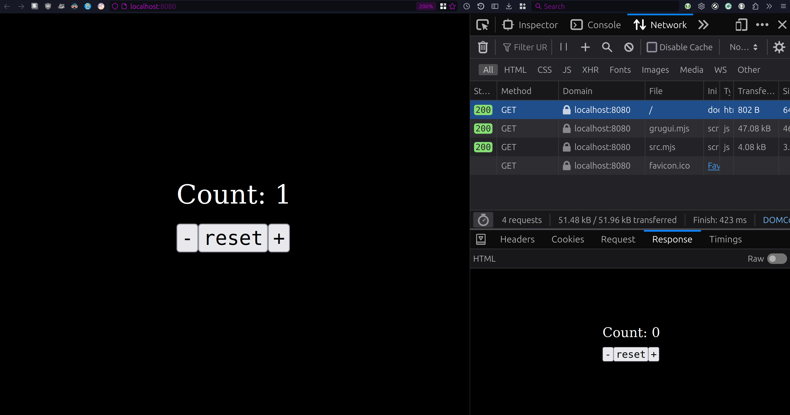

# Grug-UI

The `grugui.mjs` file provides utilities for generating HTML/CSS DOM/strings
and creating interactive page elements.


# Installation
1. Copy `grugui.mjs` into your project.
2. (Optional: Scan (speed read)/search the code to verify it's not 
   doing anything it shouldn't)


# Usage

## Client-side

1. Serve a HTML file that loads `grugui.mjs` and your application code,
   e.g. `src.mjs`:
   ```html 
   <!-- index.html -->
   <!DOCTYPE html>
   <html ...>
        <head>
            ...
            <script src="./grugui.mjs" type="module" defer></script>
            <script src="./src.mjs" type="module" defer></script>
            ...
        </head>
        <body>
            <main id="app"></main>
        </body>
   </html>
   ```
   (You can use python's `http.server` standard library module to 
   serve the contents of the project directory if you have it installed: 
   `python3 -m http.server -d . -b localhost 8080`)
2. Use the Grug-UI's API to create an integrative Web interface
   in your application code, e.g.:
   ```js
   //-- src.mjs --
   import grugui from "./grugui.mjs";

   // Application state
   let count = 0;

   /** (Re)render function. */
   function render() {
       grugui.setCtx("domGen");

       const {main, button, trustedText, end} = grugui;

       main({id: "app"});
           trustedText(`Count: ${count}`);
           button({onClick: () => {
               count++;
               render();
           }}); 
               trustedText("Increment");
           end();
       end();

       document.getElementById("app").replaceWith(
           grugui.getDomLastNode()
       );
   }

   render();
   ```
(see [./examples/counter-min-client-side](./examples/counter-min-client-side))

## Server-side

TODO: Document

See examples below.


## Examples

### [Counter](./examples/counter/src.mjs)



The code below illustrates the module's core functionality, including Server-Side Rendering (see screenshot above)
and interactivity. (It's very much a toy example in the name of brevity.)

```js
import grugui from "./grugui.mjs";

// Application State
let count = 0;

/** Procedure that creates a counter component. */
function counter(update) {
    const {button, css, div, end, main, span, trustedText} = grugui;

    main({id: "app"});
        div(); 
            span();
                trustedText(`Count: ${count}`);
            end();
        end();

        // Because `div()`, `end()`, etc. are single, sequentially operations,
        // you can just use regular control flow. No need for map/filter/reduce,
        // ternary expressions, or template specific syntax.
        for (const [buttonText, operation] of [
            ["-"    , () => count--  ],
            ["reset", () => count = 0],
            ["+"    , () => count++  ],
        ]) {
            button({class: "counter-btn", onClick: () => {
                operation();
                update();
            }});
                trustedText(buttonText);
            end();
        }

        css.rule(".counter-btn", {
            fontFamily: "monospace",
            fontSize: css.pt(18),
            marginTop: css.px(16),
        });
    end();
}

// We use `genHtmlPage` for Server-Side Rendering (see bottom of file)
function genHtmlPage() {
    grugui.setCtx("strGen");
    grugui.reset();

    const {doctype, html, head, script, body, style, trustedHtmlStr, end, css} = grugui;

    doctype();
    html({lang: "en"});
        head();
            script({src: "/grugui.mjs", type: "module", defer: true}); end();
            script({src: "/src.mjs", type: "module", defer: true}); end();
        end();
        body();
            css.rule("body", {
                display         : "flex",
                margin          : 0,
                padding         : 0,
                height          : css.vh(100),
                justifyContent  : "center",
                alignItems      : "center",
                fontSize        : css.pt(24),
                color           : css.rgb(255, 255, 255),
                backgroundColor : css.hex("#000"),
            });
            // Statically generate the HTML string for the counter
            counter();
            style();
                trustedHtmlStr(
                    grugui.css.getStr()
                );
            end();
        end();
    end();

    return grugui.getHtmlStr();
}

/**
 * Creates a counter DOM element and replaces the element id="app"
 * with the counter element.
 */
function createWebUi() {
    grugui.setCtx("domGen");

    counter(createWebUi);
    document.getElementById("app")
        .replaceWith(grugui.getDomLastNode());

    grugui.reset();
}

async function main() {
    let isNode = typeof process !== "undefined";

    if (isNode) {
        const fs = await import("node:fs");
        const http = await import("node:http");

        const server = http.createServer((request, response) => {
            let responseBody;
            switch (request.url) {
                case "/":
                    console.log("Rendering HTML...");
                    responseBody = genHtmlPage();
                    console.log("Rendered HTML.");

                    response.writeHead(200, {"Content-Type": "text/html"});
                    response.end(responseBody);
                    console.log("Served HTML.")
                    break;
                case "/grugui.mjs":
                case "/src.mjs":
                    responseBody = fs.readFileSync(`.${request.url}`, "utf8");

                    response.writeHead(200, {"Content-Type": "text/javascript"});
                    response.end(responseBody);
                    console.log(`Served JavaScript file '.${request.url}'.`);
                    break;
            }
        });

        server.listen(8080, "localhost");
        console.log("Server listening on http://localhost:8080...");
    } else {
        createWebUi();
    }
}

await main();
```

You can run the example above by:
1. Copying the above code to `src.mjs`
2. Copying `grugui.mjs` to the same directory as `src.mjs`
3. Running `node src.mjs`
4. Opening `http://localhost:8080` in your browser

### [Tic-Tac-Toe](./examples/tic-tac-toe/index.mjs)


## Motivation

The popularity of frontend frameworks like React, Vue, Svelte, Angular, etc.
over vanilla JavaScript illustrate the fact that Web developers a)
highly value developer ergonomics and/or b) no longer know how to build
interactive websites without a framework.

There are a few problems with relying on React, etc.:
1. These frameworks have massive code bases (relative to the scale of the
   problem) making them un-forkable/hackable and unauditable for small projects
2. Almost all projects using these frameworks rely on extra build steps to
   work (yes, you can technically use React without JSX) which often
   slows down development due to the setup and maintenance burden of
   the build systems and/or a slower iteration cycle due to long build times
3. Users of these frameworks often feel the necessity to perform massive
   rewrites in the code bases due to a transition to a newer way of doing
   things or deprecated public APIs. For example, 
   [React's class components](https://react.dev/reference/react/Component).

These problems are especially relevant for software that seeks to be long
lived or where the development effort is expected to **reduce** over time.

Here are some proposed solutions to these problems:
1. Developers should have access to better educational resources on how 
   to build highly interactive websites without frameworks and on how
   to build their own tooling for ergonomics
2. Software that does provide additional ergonomics should be small, 
   auditable and only mandate extra build steps as an opt-in, not the default
3. a) Software described in 2. should not touch security relevant APIs, 
   making updates optional. b) Software should be small enough to be
   forkable/hackable should the necessity to only modify small parts of it
   in deviations from the upstream project arise.

In this spirit, the `grugui.mjs` file attempts to provide the necessary
functionality to create small, interactive websites with ergonomics
similar to that of React and co., in a small, auditable package.

It's a work-in-progress and there's still a lot that could be improved upon.

Other personal motivations are as follow:
- to improve my personal knowledge on how to build websites without frontend
  frameworks
- have a dependency for quickly building interactive Web-UI that I control
  and doesn't require tedious setup
